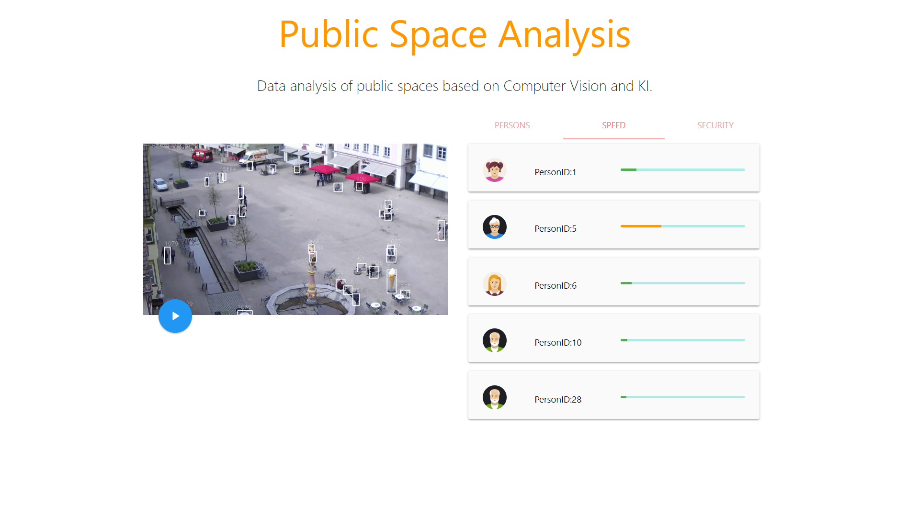
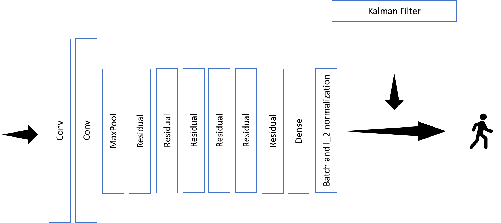

# EnBW Hackathon - Gruppe CitySafety

## Usecase 1 - Analyse von Gruppenverhalten und Gruppenkonstellationen im Themenumfeld computer vision

Unser Projekt nutzt das `deep_sort` Verfahren. Dadurch sind wir in der Lage Personen auf öffentlichen Plätzen zu `tracken` und so zuverlässig Geschwindigkeiten zu bestimmen. Zusätzlich kann über die für das Tracking genutzten Bounding Boxen die Anzahl der Personen ermittelt werden. Die Analyse kann sowohl in Echtzeit als auch auf historischen Daten erfolgen. Die Ergebnisse sind über eine Benutzeroberfläche einsehbar.

Die erhobenen Daten können von öffentlichen Institutionen für verschiedene Zwecke eingesetzt werden:

* Zählung von Personen auf öffentlichen Plätzen (umgesetzt)
* Fluchterkennung (umgesetzt)
* Betreten verbotener Bereiche (umgesetzt)
* Erkennung unbewegter Personen, z.B. bei einem Unfall
* Verkehrsplanung

Die Daten werden aggregiert, so dass auch Entwicklungen über die Zeit deutlich werden und nachvollzogen werden können.

## Verarbeitungspipeline

Die Verarbeitung gliedert sich in die folgenden Schritte, diese werden im Folgenden detailliert:

    Videomaterial 
          -> deep_sort (Ausgabe: Video & CSV)
                 -> Video mit Bouding Boxes 
                         -> UI
                 -> CSV-Datei mit Tracking Informationen
                         -> JupyterNotebook
                                 -> JSON
                                       -> UI

### Videoverarbeitung

Die Videos werden mit einem (angepassten) [Tracking](https://github.com/bendidi/Tracking-with-darkflow) Framework verarbeitet. Details zu dem Anpassungen sind in [INSTALL](INSTALL.md).

Das Framework setzt auf YOLOv2 auf. Die bereitgestellten Videos vom Marktplatz in Biberach werden analysiert und die Personen werden anhand ihrer BoundingBox getrackt. Über das Tracking können verschiedene Daten abgeleitet werden, zum Beispiel, ob die Geschwindigkeiten der Personen oder ob diese einen gesperrten Bereich betritt. 
Wir haben mithilfe von YOLOv2 die bereitgestellten Videos von dem Marktplatz in Biberach analysiert und die Personen getaggt, indem wir über jede Person eine BoundingBox gelegt haben. Ein Beispielvideo zeigt dieses Tracking in Echtzeit. Zudem kann immer die aktuelle Anzahl an Personen auf dem Platz bestimmt und in Relation mit anderen Werten gesetzt werden.

### CSV Datei

Aus jedem Video erzeugen wir eine CSV-Datei mit folgenden Daten: 

    (frame_id,track_id,x,y,w,h)

Die `frame_id` ist die ID des Frames im verarbeiteten Video.  
Die `track_id` ist die ID jeder Person, die von YOLO erkannt wird.  
`x,y` sind die Koordinaten der oberen Ecke der BoundingBox in Pixel. Das Video hat die Größe 1920 * 1080.
`w,h` sind die Größe der BoundingBox.

### Analysen / JupyterNotebook

Die CSV nutzen wir für unsere Analysen. Zum einen bestimmen wir die aktuelle Anzahl an Personen pro Frame. Daraus können wir eine Zeitreihenanalyse machen und feststellen, wenn auffallend viele/wenige Personen zu einer bestimmten Uhrzeit auf dem Marktplatz sind. Wenn hier Auffälligkeiten vorliegen, kann direkt die Security alarmiert werden und mehr Streifen auf den Platz geschickt werden.

Eine andere Anwendung ist die Bestimmung der Geschwindigkeiten, mit der sich bestimmte Gegenstände bewegen. Diese haben wir grob per Entfernungsmessung aus Google Maps in km/h umgerechnet. So kann bestimmt werden, wenn sich Radfahrer besonders schnell bewegen. Flüchtende Personen sind auch ein Problem, das so detektiert werden kann.

Diese Daten werden in einem JSON Dokument an die UI weitergeleitet.

### UI

Die UI ist für die Stadt Biberach / andere Gemeinenden oder Institutionen mit Sicherheitsbedürfnissen gedacht. Technisch setzt die UI auf _jQuery_ und _Materialized CSS_ auf.

Die UI ermöglicht neben der Ansicht der beschriebenen Daten auch einen Blick auf das Busnetz - sind zum Beispiel an einem Platz ungewöhnliche viele Personen können zusätzliche Busse eingesetzt werden.

Die Hauptansicht ist das aufgenommene und annotierte Video mit den berechneten Daten. Zu jeder Person ist die Geschwindigkeit zu sehen. Zusätzlich gibt es eine Meldung, wenn ein abgesperrter Bereich betreten wird (im Video rot markiert).

## Timeline

* 12:00 Startschuss
* 14:10 Tracking funktioniert
* 15:36 CSV generiert
* 16:32 Video mit Tracking-Info in Echtzeit
* 18:00 Geschwindigkeitserkennung
* 18:30 Brainstorming
* 19:30 Erkennung Fahrräder / schnelle Personen
* 20:20 Datenexport JSON für UI
* 21:35 Test: Tracking funktioniert auch nachts
* 23:15 Baustellenerkennung
* 00:30 Meeting - weiteres Vorgehen
* 01:00 Thread.sleep()
* 07:30 Frühstück
* 08:35 Finales Video
* 09:42 Pflege Git-Repo
* 11:30 Fertigstellung UI
* 11:45 Abgabe

## Ausblick

Die Übertragung der Videoerkennung auf andere Bereiche ist leicht umsetzbar - man muss dazu nur anderes Videomaterial verwenden und die Entfernungen neu ausmessen. So könnte zum Beispiel ein Übertritt des Baches in der Eingangshalle der EnBW direkt detektiert werden.

Eine Erweiterung des Trackings auf andere Gegenstände wie Autos ist einfach umzusetzen, allerdings haben wir uns zuerst auf Personen fokussiert.

Die Stadt kann unsere Zeitreihenanalyse nutzen, um den ÖPNV zu verbessern.

Leider konnten wir nicht mehr umsetzen, dass eine Person lange an einem Ort stehen bleibt. Die Brunnenstatue oder fest installierte Gegenstände wie die Eiswaffel werden kontinuierlich als Person betrachtet. Dazu müsste man zuerst das ganze Netz neu trainieren, wozu wir weder Zeit noch Rechenkapazitäten hatten.

