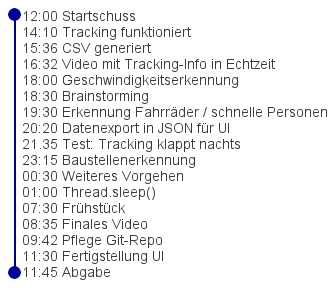

# EnBW Hackathon - Gruppe Torsionspendel

## Einführung

Wir bearbeiten Usecase 1: Erkennung von speziellen Situationen im Kontext von Öffentlicher Sicherheit mittels computer vision.

Wir haben mithilfe von YOLOv2 die bereitgestellten Videos von dem Marktplatz in Biberach analysiert und die Personen getaggt, indem wir über jede Person eine BoundingBox gelegt haben. Ein Beispielvideo zeigt dieses Tracking in Echtzeit. Aus dem Tracken der Personen können wir verschiedene Daten ableiten, wie die aktuelle Geschwindigkeit und langes verweilen auf einem Platz. Außerdem kann direkt erkannt werden, ob eine Person einen gesperrten Bereich betritt, zum Beispiel eine Baustelle. Zudem können wir immer die aktuelle Anzahl an Personen auf dem Platz bestimmen und in Relation mit anderen Werten setzen.

## Verarbeitung

### Videoverarbeitung

Für die Verarbeitung der Videos nutzen wir ein vortrainiertes neuronales Netz.

### CSV Datei

Aus jedem Video erzeugen wir eine CSV-Datei mit folgenden Daten: (frame_id,track_id,x,y,w,h) .

Die frame_id ist die ID des Frames - die Videos haben eine Rate von 30 fps, teilweiße skippen wir beim Einlesen einige Frames.

Die track_id ist die ID jeder Person, die von YOLO erkannt wird.

x,y sind die Koordinaten der oberen Ecke der BoundingBox in Pixel. Das Video hat die Größe 1920 * 1080.

w,h sind die Größe der BoundingBox.

### Analysen

Die CSV nutzen wir für unsere Analysen. Zum einen bestimmen wir die aktuelle Anzahl an Personen pro Frame. Daraus können wir eine Zeitreihenanalyse machen und feststellen, wenn auffallend viele/wenige Personen zu einer bestimmten Uhrzeit auf dem Marktplatz sind. Wenn hier Auffälligkeiten vorliegen, kann direkt die Security alarmiert werden und mehr Streifen auf den Platz geschickt werden.

Eine andere Anwendung ist die Bestimmung der Geschwindigkeiten, mit der sich bestimmte Gegenstände bewegen. Diese haben wir grob per Entfernungsmessung aus Google Maps in kmh umgerechnet. So kann bestimmt werden, wenn sich Radfahrer besonders schnell bewegen. Flüchtende Personen sind auch ein Problem, das so detektiert werden kann.

Diese Daten werden in einem json Dokument an die UI weitergeleitet.

### UI

Die UI ist für die Stadt gedacht. 

## TimeLine

* 12:00 Startschuss

* 14:10 Tracking funktioniert

* 15:36 CSV generiert

* 16:32 Video mit Tracking-Info in Echtzeit

* 18:00 Geschwindigkeitserkennung

* 18:30 Brainstorming - neue Ideen für Usecases

* 19:30 erkennung von FahrrÀdern und besonders schnellen Personen

* 20:20 Dateiexport in JSON

* 21:35 Test: Tracking funktioniert auch Nachts

* 23:15 Baustellenerkennung

* 00:30 Meeting - weiteres Vorgehen im Gesamtkontext

* 01:00 Thread.sleep()

* 07:30 Frühstück

## Ausblick

Die Übertragung der Videoerkennung auf andere Bereiche ist leicht umsetzbar - man muss dazu nur anderes Videomaterial verwenden und die Entfernungen neu ausmessen. So kann zum Beispiel ein Übertritt des Baches in der Eingangshalle der EnBW direkt detektiert werden.

Die Stadt kann unsere Zeitreihenanalyse nutzen, um den ÖPNV zu verbessern.

Leider konnten wir nicht mehr umsetzen, dass eine Person lange an einem Ort stehen bleibt, da dazu das Netz nicht ausreichend trainiert ist. Die Brunnenstatue oder fest installierte Gegenstände wie die Eiswaffel werden kontinuierlich als Person betrachtet und müssten zuerst rausgerechnet werden.

